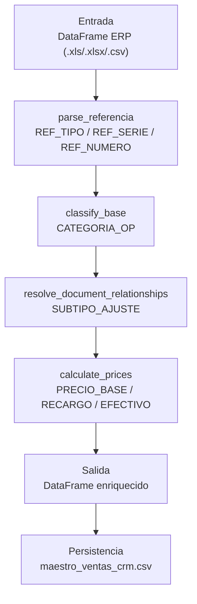

# BUSINESS_RULES.md — Motor de clasificación comercial G360

> Única fuente de verdad para reglas de negocio. Todas las reglas viven en
> `commercial_engine.py`, no en `processor.py` ni `pipeline.py`.

**Módulo**: `g360_core.commercial_engine` · **Archivo**: `py/src/g360_core/commercial_engine.py` (305 líneas)

---

## Flujo de reglas

---

## Paso 1 — Parseo de REFERENCIA (`parse_referencia`)

Extrae `REF_TIPO`, `REF_SERIE` y `REF_NUMERO` del campo `REFERENCIA`.

- **Formato esperado**: `F01/204-56287`
- **Regex**: `^([A-Z0-9]+)/(\d+)-(\d+)$`
- **Sin match**: se rellena `"S/R"` en los 3 campos.

---

## Paso 2 — Clasificación primaria (`classify_base`)

Solo mira la fila actual. No cruza con otros documentos.

| TPO_DOC | CANTIDAD | → CATEGORIA_OP |
|---|---|---|
| F01, BDI, F03, B01, B03, F07, F08, B07, B08 | cualquiera | **VENTA** |
| NC\* (prefijos en `NC_PREFIXES`) | ≠ 0 | **DEVOLUCION** |
| NC\* | = 0 | **AJUSTE** |
| ND\* (prefijos en `ND_PREFIXES`) | cualquiera | **AJUSTE** |

`SUBTIPO_AJUSTE` se inicializa vacío aquí; se asigna en el paso 3.

---

## Paso 3 — Resolución de relaciones (`resolve_document_relationships`)

Cruza `REFERENCIA` (parseada) contra el índice de facturas construido por `build_invoice_index`.

**Clave del índice**: `(TPO_DOC, SERIE_DOC, NRO_DOC, ID_ARTICULO)`
**Solo se indexan registros VENTA.** Si no hay facturas en el dataset, todo AJUSTE → `SIN_BASE`.

| Condición (clave encontrada en índice) | CANTIDAD_FAE del ajuste | → SUBTIPO_AJUSTE |
|---|---|---|
| Clave con SKU coincide | = 0 | **CARGO_FIJO** |
| Clave con SKU coincide | ≈ CANTIDAD factura (±0.01) | **PRECIO_LINEA** |
| Clave con SKU coincide | < CANTIDAD factura | **PRECIO_PARCIAL** |
| Clave con SKU coincide | > CANTIDAD factura | **SIN_BASE** |
| Clave no coincide | CANTIDAD_FAE = 1 | **CARGO_FIJO** |
| Clave no coincide | CANTIDAD_FAE ≠ 1 | **SIN_BASE** |

> **⚠ Discrepancia detectada vs README.md**: el README actual (líneas 350–352)
> solo menciona `PRECIO_LINEA / SIN_BASE` y omite `PRECIO_PARCIAL`. El código
> define 4 subtipos. La fuente de verdad es el código.

---

## Paso 4 — Cálculo de precios (`calculate_prices`)

| Columna derivada | Fórmula | Cuándo aplica |
|---|---|---|
| `PRECIO_BASE` | `\|SOLES\| / \|CANTIDAD\|` | Solo filas con `CANTIDAD ≠ 0` (movimiento físico) |
| `RECARGO_UNITARIO` | `SOLES / \|CANTIDAD_FAE\|` | Solo AJUSTE con `SUBTIPO ∈ {PRECIO_LINEA, PRECIO_PARCIAL}` y `CANTIDAD_FAE ≠ 0` |
| `PRECIO_EFECTIVO` | `PRECIO_BASE + RECARGO_UNITARIO` | Solo si `PRECIO_BASE` no es NaN |

`PRECIO_EFECTIVO` = **precio físico** + **ajuste financiero FAE**. El recargo
se propaga a nivel de agregación, no se suma directamente en ajustes linkeados.

---

## Funciones públicas

| Función | Paso | Retorna |
|---|---|---|
| `parse_referencia(df)` | 1 | df + `REF_TIPO`, `REF_SERIE`, `REF_NUMERO` |
| `classify_base(df)` | 2 | df + `CATEGORIA_OP`, `SUBTIPO_AJUSTE` (vacío) |
| `build_invoice_index(df)` | 3a | `dict` clave→{CANTIDAD, SOLES, FAE} |
| `resolve_document_relationships(df)` | 3b | df + `SUBTIPO_AJUSTE` completo |
| `calculate_prices(df)` | 4 | df + `PRECIO_BASE`, `RECARGO_UNITARIO`, `PRECIO_EFECTIVO` |

---

*Generado por `g360 docs --level business-rules` · Fuente: `commercial_engine.py:1`*
