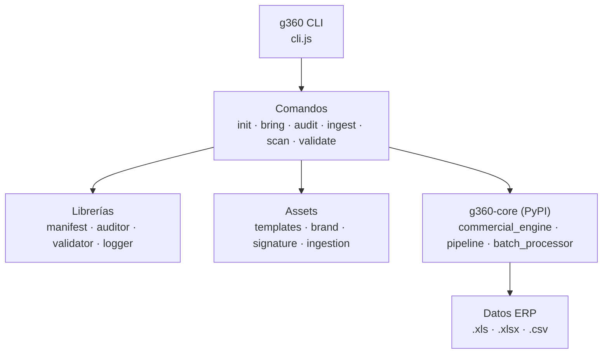

# g360-cli

<picture>
  <source media="(prefers-color-scheme: dark)" srcset="src/assets/brand/g360/logotypes/logo-g360-light.svg">
  
</picture>

> CLI tool for bootstrapping G360 projects with standardized structure, assets, and identity

[](https://www.npmjs.com/package/g360-cli)
[](https://opensource.org/licenses/MIT)
[](https://www.npmjs.com/package/g360-cli)

## ¿Cómo está organizado el proyecto?



## Tabla de Contenidos

- [Descripción](#descripción)
- [Características](#características)
- [Tecnologías](#tecnologías)
- [Instalación](#instalación)
- [Inicio Rápido](#inicio-rápido)
- [Comandos](#comandos)
- [Plantillas](#plantillas)
- [Componentes](#componentes)
- [Skills](#skills)
- [Convenciones de Nombres](#convenciones-de-nombres)
- [Configuración](#configuración)
- [API](#api)
- [Estructura](#estructura)
- [Reglas de negocio](#reglas-de-negocio)
- [Scripts](#scripts)
- [Testing](#testing)
- [Contribución](#contribución)
- [Licencia](#licencia)
- [Ecosistema G360](#ecosistema-g360)
- [Integración con OpenCode](#integración-con-opencode)

---

## Descripción

CLI tool para el ecosistema G360 que permite inicializar proyectos con estructura estándar, gestionar assets embebidos, y asegurar compliance mediante auditoría automática. Forma parte del núcleo del ecosistema y está disponible como paquete global de npm.

**Tipo**: CLI Tool / Scaffolding / Generator  
**Plataforma**: Node.js >= 18.0.0  
**Distribución**: npm global (`npm install -g g360-cli`)

---

## Tecnologías

- **Runtime**: Node.js >= 18.0.0
- **Lenguaje**: JavaScript (ESModules)
- **CLI Framework**: Commander 14.x
- **UI**: Chalk 5.x (colores), Ora 9.x (spinners), Inquirer 13.x (prompts)
- **Filesystem**: fs-extra 11.x
- **Build**: pkg 5.8.1 (portable .exe)
- **Distribución**: npm global

---

## Características

- **Inicialización rápida** - Crea proyectos G360 con estructura estándar
- **Gestión de assets** - Trae componentes, skills y plantillas embebidas
- **Ingesta ERP** - Normaliza `.xls/.xlsx` de SAP, StarSoft, Spring con `g360 bring ingestion`
- **Motor de clasificación comercial** - `commercial_engine` clasifica documentos en VENTA/DEVOLUCION/AJUSTE con subtipos (PRECIO_LINEA, CARGO_FIJO, SIN_BASE)
- **Precio efectivo** - PRECIO_BASE, RECARGO_UNITARIO y PRECIO_EFECTIVO separan precio físico de ajustes financieros FAE
- **Paquete Python** - `g360-core` en PyPI para pipelines de datos independientes
- **Auditoría** - Verifica compliance de proyectos G360
- **Limpieza** - Elimina assets embebidos antes de deployment
- **Multi-plantilla** - Web (Lit, Solid, Svelte, PWA, React), Python (CLI, Flet ⭐, Flet Polished ⭐, CustomTkinter, Migration)
- **Flet Polished** - Template estandar con dual theme, auto-refresh, hash cache, search debounce, KPI glow, G360 signature, portable launcher
- **Brand System v2.0.0** - Sistema de marca unificado con favicons, PWA icons, logotypes para G360 y CIPSA
- **Modo portable** - Proyectos Python con ejecución directa (sin PyInstaller)
- **Modo offline** - Funciona sin conexión usando assets cacheados
- **Preview** - Dry-run para previsualizar cambios

---

## Versión

**Current: v1.15.7** — [Ver en npm](https://www.npmjs.com/package/g360-cli)

---

## Instalación

### Requisitos

- Node.js >= 18.0.0
- npm >= 8.0.0

### Instalación global

```bash
npm install -g g360-cli
```

### Verificar instalación

```bash
g360 --version
# → 1.15.0

g360 health
```

### Publicar nueva versión

```bash
npm version patch   # o minor / major
git push --tags
npm publish
```

---

## Inicio Rápido

```bash
# 1. Inicializar nuevo proyecto
g360 init mi-proyecto

# 2. Entrar al proyecto
cd mi-proyecto

# 3. Traer assets G360
g360 bring

# 4. Ver estructura
g360 present

# 5. Auditar proyecto
g360 audit

# 6. Limpiar antes de deploy
g360 clean
```

---

## Comandos

### `g360 init`

Inicializa un nuevo proyecto G360.

```bash
g360 init <nombre> [opciones]
```

**Opciones:**

| Opción | Descripción | Valor por defecto |
|--------|-------------|-------------------|
| `-t, --template <tipo>` | Tipo de plantilla (default: auto segun skill) | `auto` |
| `-s, --skill <skill>` | Skill a usar | `corporativo-movil` |
| `-d, --dir <ruta>` | Directorio destino | `.` |
| `--dry-run` | Previsualizar sin crear | `false` |
| `--force` | Sobrescribir existente | `false` |
| `--brand` | Aplicar marca G360 (logo, colores, firma) después de init | `false` |

**Ejemplos:**

```bash
# Proyecto Lit para cliente móvil
g360 init mi-proyecto --template lit-web --skill corporativo-movil

# Proyecto Solid para herramienta propia
g360 init mi-herramienta --template solid-web --skill moderno-movil

# Proyecto SvelteKit minimalista
g360 init mi-script --template svelte-web --skill minimalista

# Preview sin crear
g360 init mi-proyecto --dry-run

# Crear proyecto con marca G360 aplicada automáticamente
g360 init mi-proyecto --brand
```

---

### `g360 set-skill`

Cambia el skill del proyecto actual.

```bash
g360 set-skill <skill> [opciones]
```

**Opciones:**

| Opción | Descripción |
|--------|-------------|
| `--verbose` | Mostrar detalles |
| `--force` | Sobrescribir skill existente |

**Ejemplos:**

```bash
# Cambiar a skill corporativo para PC
g360 set-skill corporativo

# Cambiar a skill moderno para móvil
g360 set-skill moderno-movil

# Ver detalles del skill
g360 set-skill corporativo-g360 --verbose
```

---

### `g360 convert`

Convierte un proyecto existente a identidad G360.

```bash
g360 convert [ruta] [opciones]
```

**Opciones:**

| Opción | Descripción | Valor por defecto |
|--------|-------------|-------------------|
| `-s, --skill <skill>` | Skill a aplicar | `corporativo-movil` |
| `--dry-run` | Previsualizar sin aplicar | `false` |
| `--restructure` | Reestructurar archivos | `false` |
| `--force` | Forzar cambios peligrosos | `false` |
| `--backup` | Crear backup antes | `false` |

**Ejemplos:**

```bash
# Preview de cambios
g360 convert . --dry-run

# Convertir proyecto existente
g360 convert ./mi-proyecto --skill corporativo

# Con backup automático
g360 convert . --skill moderno --backup

# Forzar cambios peligrosos
g360 convert . --skill corporativo-movil --force
```

---

### `g360 signature`

Instala el componente de firma oficial G360 en proyectos web.

```bash
g360 signature install [opciones]
```

**Opciones:**

| Opción | Descripción | Valor por defecto |
|--------|-------------|-------------------|
| `-p, --path <ruta>` | Ruta al index.html | `.` |
| `--force` | Reinstalar si ya existe | `false` |

**Ejemplos:**

```bash
# Instalar en el directorio actual
g360 signature install

# Forzar reinstalación
g360 signature install --force
```

---

### `g360 bring`

Trae assets G360 al proyecto actual.

```bash
g360 bring [asset] [opciones]
```

**Opciones:**

| Opción | Descripción |
|--------|-------------|
| `-p, --path <ruta>` | Ruta destino |
| `--dry-run` | Previsualizar |
| `--force` | Sobrescribir |

**Ejemplos:**

```bash
# Traer todos los assets
g360 bring

# Traer solo componentes
g360 bring components

# Traer solo skills
g360 bring skills

# Traer engine específico
g360 bring engine/g360-skill-audit

# Traer ingestion module ERP a proyecto Flet existente
g360 bring ingestion
```

### `g360 bring ingestion`

Instala el módulo de normalización de datos ERP en proyectos Flet.

```bash
g360 bring ingestion [opciones]
```

**Opciones:**

| Opción | Descripción |
|--------|-------------|
| `-p, --path <ruta>` | Ruta al proyecto |
| `--dry-run` | Previsualizar |
| `--force` | Sobrescribir archivos existentes |

**Archivos instalados:**
- `src/core/ingestion.py` — Normalización de datos (estabilizar_excel_crudo)
- `src/ui/ingestion_panel.py` — Panel Flet para carga de archivos

**Importación (auto-detects pip → local):**
```python
# Si g360-core está instalado via pip → from g360_core.ingestion import ...
# Si no → from core.ingestion import ...
from ui.ingestion_panel import IngestionPanel
```

El paquete pip acompañante `g360-core` se publica en PyPI:
```bash
pip install g360-core
```

### `g360-core` — Módulos principales

#### `commercial_engine.py`

Motor de lógica de negocio para clasificación documental. Única fuente de verdad para reglas comerciales.

| Función | Propósito |
|---------|-----------|
| `classify_base()` | Clasificación primaria: VENTA, DEVOLUCION, AJUSTE |
| `build_invoice_index()` | Índice de facturas para cruce de referencias |
| `resolve_document_relationships()` | Asigna SUBTIPO_AJUSTE (PRECIO_LINEA, CARGO_FIJO, SIN_BASE) |
| `calculate_prices()` | PRECIO_BASE, RECARGO_UNITARIO, PRECIO_EFECTIVO |
| `parse_referencia()` | Descompone REFERENCIA "F01/204-56287" en tipo/serie/número |

**Clasificación de documentos** (`classify_base` → primero, `resolve_document_relationships` → después para AJUSTE):
```
TPO_DOC          CANTIDAD   →  CATEGORIA_OP   SUBTIPO_AJUSTE (cruce vs índice)
F01/BDI/F03/...  cualquiera →  VENTA          —
NC*              ≠ 0        →  DEVOLUCION     —
NC*              = 0        →  AJUSTE         (ver reglas de cruce abajo)
ND*              cualquiera →  AJUSTE         (ver reglas de cruce abajo)
```
Subtipos de AJUSTE (`resolve_document_relationships` cruza `REFERENCIA` contra `build_invoice_index`):
```
Clave con SKU coincide   CANTIDAD_FAE = 0            → CARGO_FIJO
Clave con SKU coincide   CANTIDAD_FAE ≈ CANT_FACT    → PRECIO_LINEA
Clave con SKU coincide   CANTIDAD_FAE < CANT_FACT    → PRECIO_PARCIAL
Clave con SKU coincide   CANTIDAD_FAE > CANT_FACT    → SIN_BASE
Clave no coincide        CANTIDAD_FAE = 1            → CARGO_FIJO
Clave no coincide        CANTIDAD_FAE ≠ 1            → SIN_BASE
Sin facturas en dataset  —                            → SIN_BASE (todo AJUSTE)
```
> Ver detalle completo en [`BUSINESS_RULES.md`](./BUSINESS_RULES.md).

#### `batch_processor.py`

| Función | Propósito |
|---------|-----------|
| `read_erp_file()` | Punto único de lectura: .xls (xlrd), .xlsx (openpyxl), .csv. `dtype=str` preserva ceros a la izquierda |

---

### `g360 list`

Lista assets disponibles.

```bash
g360 list [tipo] [opciones]
```

**Tipos:**

| Tipo | Descripción |
|------|-------------|
| `templates` | Lista de plantillas |
| `components` | Lista de componentes |
| `skills` | Lista de skills |
| `ingestion` | Módulo de ingesta ERP |
| `all` | Todo (por defecto) |

**Ejemplos:**

```bash
# Listar todo
g360 list

# Solo plantillas
g360 list templates

# Solo componentes
g360 list components

# Salida JSON
g360 list --json
```

---

### `g360 present`

Presenta la estructura del proyecto.

```bash
g360 present [ruta] [opciones]
```

**Opciones:**

| Opción | Descripción | Valor por defecto |
|--------|-------------|-------------------|
| `--depth <n>` | Profundidad máxima | `3` |

**Ejemplo:**

```bash
g360 present
g360 present ./mi-proyecto --depth 2
```

---

### `g360 audit`

Audita el proyecto para compliance G360.

```bash
g360 audit [ruta] [opciones]
```

**Opciones:**

| Opción | Descripción |
|--------|-------------|
| `--fix` | Auto-corregir problemas |
| `--verbose` | Salida detallada |

**Ejemplo:**

```bash
g360 audit
g360 audit ./mi-proyecto --verbose
```

---

### `g360 clean`

Limpia código muerto, duplicados y archivos huérfanos del proyecto.

```bash
g360 clean [ruta] [opciones]
```

**Opciones:**

| Opción | Descripción |
|--------|-------------|
| `--dry-run` | Previsualizar archivos |
| `--force` | Omitir confirmación |
| `--dead` | Eliminar archivos muertos/descontinuados |
| `--duplicates` | Eliminar archivos duplicados |
| `--orphans` | Eliminar archivos huérfanos (sin referencias) |
| `--organize` | Mostrar archivos descolocados |
| `--all` | Ejecutar todas las verificaciones |

**Ejemplos:**

```bash
# Preview de limpieza completa
g360 clean --dry-run --all

# Solo archivos muertos
g360 clean --dead --force

# Solo duplicados
g360 clean --duplicates --force

# Verificar huérfanos (sin eliminar)
g360 clean --orphans --dry-run
```

---

### `g360 health`

Verifica el estado del sistema.

```bash
g360 health [opciones]
```

**Opciones:**

| Opción | Descripción |
|--------|-------------|
| `--verbose` | Info detallada |

**Ejemplo:**

```bash
g360 health
g360 health --verbose
```

---

### `g360 update`

Actualiza g360-cli a la última versión.

```bash
g360 update [opciones]
```

**Opciones:**

| Opción | Descripción |
|--------|-------------|
| `--check` | Solo verificar sin actualizar |

**Ejemplo:**

```bash
# Verificar nueva versión
g360 update --check

# Actualizar
g360 update
```

---

### `g360 config`

Visualiza o modifica la configuración de g360-cli.

```bash
g360 config [opciones]
```

**Opciones:**

| Opción | Descripción |
|--------|-------------|
| `--list` | Listar todas las opciones de configuración |
| `--get <key>` | Obtener valor de una configuración |
| `--set <key=value>` | Establecer un valor de configuración |

**Ejemplos:**

```bash
# Listar configuración disponible
g360 config --list

# Verificar skill actual
g360 config --get skill
```

---

### `g360 scan`

Escanea un directorio para detectar archivos ERP válidos (.xls, .xlsx, .csv).

```bash
g360 scan <directorio> [opciones]
```

**Opciones:**

| Opción | Descripción | Valor por defecto |
|--------|-------------|-------------------|
| `-r, --recursive` | Buscar recursivamente | `true` |
| `--min-score <n>` | Puntuación mínima de coincidencia | `10` |

**Ejemplos:**

```bash
# Escanear directorio actual
g360 scan .

# Escanear recursivamente con puntuación mínima
g360 scan ./data --min-score 20

# Solo directorio actual (sin recursión)
g360 scan ./exports --no-recursive
```

---

### `g360 validate`

Valida archivos ERP (.xls, .xlsx, .csv) sin procesar completamente.

```bash
g360 validate <archivos...> [opciones]
```

**Opciones:**

| Opción | Descripción |
|--------|-------------|
| `-r, --recursive` | Buscar recursivamente en directorios |

**Ejemplos:**

```bash
# Validar un archivo
g360 validate factura.xlsx

# Validar múltiples archivos
g360 validate *.xlsx *.xls

# Validar todos los archivos ERP en un directorio
g360 validate ./exports --recursive
```

---

### `g360 ingest`

Procesa archivos ERP y genera un CSV maestro normalizado.

```bash
g360 ingest <input> [opciones]
```

**Opciones:**

| Opción | Descripción | Valor por defecto |
|--------|-------------|-------------------|
| `-o, --output <archivo>` | Ruta de salida CSV | `maestro_ventas_crm.csv` |

**Archivos de entrada soportados:** `.xls`, `.xlsx`, `.csv`

**Ejemplos:**

```bash
# Procesar un archivo Excel
g360 ingest ventas_sap.xlsx

# Procesar directorio completo
g360 ingest ./exports/ -o consolidado.csv

# Procesar con nombre de salida personalizado
g360 ingest reporte.xlsx -o mi_reporte.csv
```

---

## Plantillas

### python-flet-polished ⭐ (Estandar actual)

Plantilla desktop Python con Flet — patrones de UI avanzados heredados de produccion.

```
mi-proyecto/
├── main.py
├── src/
│   ├── app.py
│   ├── config/theme.py
│   ├── core/constants.py, processor.py
│   └── ui/dashboard.py, kpi_card.py, search_overlay.py
├── g360_flet/g360_signature.py
├── assets/fonts/, images/, data/
├── run.bat, launch.vbs, build-portable.bat
├── skill.json, pyproject.toml
└── sync_portable.py
```

### web-pwa

Plantilla Progressive Web App con React.

```
mi-proyecto/
├── index.html
├── src/
│   ├── main.jsx
│   ├── App.jsx
│   ├── components/
│   │   ├── Header.jsx
│   │   ├── FooterSignature.jsx
│   │   └── LoadingOverlay.jsx
│   └── styles/main.css
├── vite.config.js
├── package.json
└── skill.json
```

### lit-web

Plantilla Web Components con Lit.

```
mi-proyecto/
├── index.html
├── src/
│   ├── index.js
│   ├── components/
│   │   └── app-root.js
│   └── styles/
│       └── main.css
├── vite.config.js
├── package.json
└── skill.json
```

### solid-web

Plantilla con SolidJS.

```
mi-proyecto/
├── index.html
├── src/
│   ├── index.jsx
│   ├── components/
│   │   └── App.jsx
│   └── styles/
│       └── main.css
├── vite.config.js
├── package.json
└── skill.json
```

### svelte-web

Plantilla con SvelteKit.

```
mi-proyecto/
├── src/
│   ├── app.html
│   ├── app.css
│   ├── routes/
│   │   └── +page.svelte
│   └── core/
│       └── skill.json
├── svelte.config.js
├── package.json
└── skill.json
```

### web-pwa (React)

Plantilla React + Vite con PWA.

```
mi-proyecto/
├── index.html
├── app.js
├── styles.css
├── manifest.json
└── package.json
```

### python-cli

Plantilla CLI de Python con estructura argparse completa.

```
mi-cli/
├── src/
│   ├── main.py
│   └── core/
│       └── skill.json
├── requirements.txt
├── run.bat
├── build-portable.bat
└── skill.json
```

### python-flet (LEGACY)

> ⚠️ **Deprecado** — Usar `python-flet-polished` para nuevos proyectos.

Plantilla GUI de escritorio con **Flet** para apps de contexto ERP.

```
mi-app/
├── src/
│   ├── main.py                  ← Punto de entrada con IngestionPanel integrado
│   ├── core/
│   │   ├── ingestion.py         ← Normalizador de datos ERP
│   │   ├── g360_theme.py        ← Tema visual G360
│   │   └── skill.json
│   ├── ui/
│   │   └── ingestion_panel.py   ← Panel Flet para carga .xls/.xlsx
│   └── export/
│       └── __init__.py
├── pyproject.toml                ← Dependencias: flet, pandas, g360-core
├── run.bat
├── build.bat
└── skill.json
```

**Normalización de datos:** La ingesta aplica transformaciones automáticas:
- Parseo de referencias (`F01/201-243065` → tipo, serie, periodo, número)
- Separación de sucursales (nombre + dirección)
- Clasificación de documentos (RUC 11 dígitos / DNI 8 dígitos)
- Normalización monetaria con auto-detección de formato SAP/Spring
- Cantidad + Cantidad FAE → cantidad_total + tipo_transaccion
- **Clasificación comercial**: VENTA / DEVOLUCION / AJUSTE con subtipos PRECIO_LINEA, CARGO_FIJO, SIN_BASE
- **Precio efectivo**: PRECIO_BASE (físico) y RECARGO_UNITARIO (financiero) separados
- Cruce de NC/NDB contra facturas referenciadas para determinar ajustes de precio por línea
- Purga de filas total/general/acumulado
- **Columnas derivadas para UI**: `cliente_label`, `vendedor_label`, `articulo_label`, `linea_label`, etc. (ID - NOMBRE)
- **Cliente completo**: `cliente_full_label` = ID_CLIENTE - DOC_CLIENTE_CLEAN - NOM_CLIENTE
- **Código de factura**: `doc_completo` = TPO_DOC + SERIE_DOC + NRO_DOC (ej: "F204-56287")
- **Precio unitario**: `precio_base` = SOLES / CANTIDAD

### python-flet-migrate

Plantilla para migrar aplicaciones Tkinter/CTkinter a Flet.

```
mi-app/
├── src/
│   ├── main.py
│   └── migrate_tkinter.py
├── requirements.txt
└── skill.json
```

### python-customtkinter

Plantilla GUI de escritorio con **CustomTkinter** (tema oscuro moderno).

```
mi-app/
├── src/
│   ├── main.py
│   └── core/
│       └── skill.json
├── requirements.txt
├── run.bat
└── build-portable.bat
```

---

## Componentes

### g360-signature

Firma G360 para proyectos web (Web Component).

```html
<!-- Modo para clientes -->
<g360-signature mode="powered"></g360-signature>

<!-- Modo propio -->
<g360-signature mode="own"></g360-signature>

<!-- Con versión -->
<g360-signature mode="powered" version="1.0.0"></g360-signature>
```

**Atributos:**
- `mode`: "own" (G360 by ccusi) o "powered" (powered by G360)
- `version`: Número de versión opcional

**Características:**
- Isotipo: 3 puntos verticales + chevron >
- Colores: #00d084 (verde), #94a3b8 (gris)
- Opacidad: 0.4 por defecto, 1.0 en hover
- Tema: auto-detecta prefers-color-scheme

### G360DragModal

Modal draggable para interfaces.

```jsx
import G360DragModal from './g360/components/G360DragModal.jsx';

G360DragModal({
  isOpen: true,
  title: 'Configuración',
  onClose: () => setOpen(false),
  children: '<p>Contenido del modal</p>'
});
```

---

## Skills

Los skills definen el estilo visual, dispositivo y signature del proyecto.

### corporativo

Proyectos para clientes - estilo corporativo conservador (PC).

### corporativo-movil

Proyectos para clientes - estilo corporativo - enfoque móvil.

### corporativo-g360

Proyectos para clientes con colores G360 vibrantes (PC).

### corporativo-g360-movil

Proyectos para clientes con colores G360 - enfoque móvil.

### moderno

Herramientas propias G360 - estilo innovador (PC).

### moderno-movil

Herramientas propias G360 - estilo innovador (móvil).

### minimalista

Proyectos minimalistas - scripts, CLI, Python.

### custom

Configuración personalizada - colores ajustables.

### flet-desktop

Aplicaciones de escritorio Flet - estilo moderno G360 (PC).

### flet-desktop-corporativo

Aplicaciones Flet para clientes - estilo corporativo conservador.

### cipsa

Proyectos con marca CIPSA - favicon CIPSA rojo, logo corporativo, signature "powered by G360".

### cipsa-movil

Apps móviles con marca CIPSA - favicon CIPSA rojo, logo corporativo, enfoque móvil.

### flet-desktop-polished

App Flet desktop con patrones UI avanzados: dual theme, auto-refresh, hash cache, search debounce, KPI glow, G360 signature widget. **Estandar actual para Flet.**

### react-web

Aplicaciones web con React/JSX - estilo G360 moderno.

### solid-web

Aplicaciones web con SolidJS - estilo G360 moderno.

### svelte-web

Aplicaciones web con Svelte/SvelteKit - estilo G360 moderno.

### lit-web

Aplicaciones web con Lit Web Components - estilo G360 moderno.

### customtkinter

Aplicaciones desktop con CustomTkinter - estilo G360 moderno.

### Ejemplos de uso

```bash
# Al crear proyecto
g360 init mi-proyecto --skill corporativo-movil

# Cambiar skill después
g360 set-skill moderno

# Ver skills disponibles
g360 list skills

# Aplicar marca a proyecto existente
g360 bring brand/cipsa

# Convertir proyecto con nuevo skill
g360 convert . --skill flet-desktop-polished --force
```

---

## Convenciones de Nombres

Las aplicaciones G360 siguen un sistema de nomenclatura estandarizado para ser identificables y consistentes en el ecosistema.

### Clases UI

| Sufijo | Uso | Ejemplo |
|--------|-----|---------|
| `App` | Orquestador principal | `StockMonitorApp`, `G360App` |
| `Dashboard` | Vista principal con KPIs | `SalesDashboard` |
| `Card` | Tarjeta reutilizable | `KpiCard`, `WarehouseCard` |
| `Modal` | Ventana modal | `ExportModal`, `SearchModal` |
| `Overlay` | Capa flotante | `SearchOverlay`, `LoadingOverlay` |
| `Badge` | Indicador pequeno | `HealthBadge` |
| `Chip` | Tag seleccionable | `WarehouseChip` |
| `Table` | Tabla de datos | `ProductTable` |

### Funciones/Metodos

| Prefijo | Uso | Ejemplo |
|---------|-----|---------|
| `_setup_` | Inicializacion | `_setup_page()`, `_setup_theme()` |
| `_build_` | Construccion UI | `_build_header()`, `_build_content()` |
| `_on_` | Event handlers | `_on_click()`, `_on_refresh()` |
| `_fetch_` / `_download_` | Obtencion datos | `_fetch_data()`, `_download_api()` |
| `_load_` / `_save_` | Persistencia | `_load_cache()`, `_save_data()` |
| `_update_` / `_refresh_` | Actualizacion | `_update_ui()`, `_refresh_kpis()` |
| `_show_` / `_hide_` | Visibilidad | `_show_loading()`, `_hide_overlay()` |
| `_toggle_` | Cambio estado | `_toggle_theme()` |
| `_validate_` | Validaciones | `_validate_input()` |

### Archivos

| Capa | Convention | Ejemplo |
|------|------------|---------|
| Entry | `main.py` | `main.py` |
| App | `app.py` | `app.py` |
| Config | `config/*.py` | `theme.py`, `constants.py` |
| Core | `core/*.py` | `processor.py`, `downloader.py` |
| UI | `ui/*.py` | `dashboard.py`, `kpi_card.py` |
| Modals | `ui/modals/*.py` | `export_modal.py` |

> Para mas detalles, ver [`FLET-NAMING-CONVENTIONS.md`](./FLET-NAMING-CONVENTIONS.md)

---

## Configuración

### g360-manifest.json

Archivo de manifiesto del proyecto.

```json
{
  "name": "mi-proyecto",
  "template": "web-pwa",
  "version": "1.0.0",
  "createdAt": "2024-01-01T00:00:00.000Z",
  "assets": [
    {
      "name": "components",
      "addedAt": "2024-01-01T00:00:00.000Z"
    }
  ]
}
```

### Configuración Global

```bash
# Directorio de configuración
~/.g360/

# Assets cacheados
~/.g360/cache/
```

---

## API

### Módulo Principal

```javascript
import { g360 } from 'g360-cli';

await g360.init({ name: 'proyecto', template: 'web-pwa' });
await g360.bring('components');
await g360.audit({ path: '.', verbose: true });
await g360.clean({ path: '.', force: true });
```

---

## Estructura

```
g360-cli/
├── src/
│   ├── cli.js           # Entrada principal CLI
│   ├── commands/         # Comandos (init, bring, audit, scan, validate, ingest, etc.)
│   ├── lib/             # Utilidades (assets, auditor, config, logger, validator, etc.)
│   ├── schemas/         # Schemas de validación
│   └── assets/          # Assets embebidos
│       ├── templates/    # Plantillas de proyecto
│       ├── components/   # Componentes G360
│       ├── brand/        # Sistema de marca v2.0.0 (G360 + CIPSA)
│       ├── ingestion/    # Módulo de ingesta ERP (bring)
│       ├── engine/      # G360 Engine
│       ├── snippets/    # Snippets de código reutilizables
│       └── config/      # Configuraciones (g360-skills.json, agent-skills.json, project-types.json)
├── py/                  # Paquete Python publicable en PyPI
│   ├── pyproject.toml   # g360-core
│   └── src/g360_core/   # commercial_engine.py, pipeline.py, processor.py, batch_processor.py, utils.py
├── package.json
├── CHANGELOG.md
├── README.md
└── LICENSE
```

---

## Scripts

| Comando | Descripción |
|---------|-------------|
| `npm run build` | Build portable con pkg (g360.exe) |
| `npm run build:portable` | Especificar target node18-win-x64 |
 | `npm test` | Ejecutar tests con Vitest (53 tests, 9 suites) |
| `npm run prepublishOnly` | Validación antes de publicar en npm |

---

## Testing

```bash
npm test            # Vitest — 53 tests, 9 suites
npm run test:watch  # Modo watch
npm run test:ui     # UI interactiva
npm run test:coverage
```

**Cobertura actual (v1.12.0):**
- `commands/`: init, bring, list, audit, set-skill, addon
- `lib/`: manifest, validator, asset-validator, python_runner
- **53 passing / 1 timeout** (init.test.js requiere import pesado de inquirer)

---

## Contribución

1. Fork el repositorio
2. Crea una rama (`git checkout -b feature/nueva-funcion`)
3. Commit tus cambios (`git commit -m 'Agregar nueva función'`)
4. Push a la rama (`git push origin feature/nueva-funcion`)
5. Abre un Pull Request

---

## Licencia

MIT License - ver [LICENSE](LICENSE) para más detalles.

---

## Ecosistema G360

Este proyecto forma parte de la familia de microherramientas **G360** para apoyo CRM y gestión de datos en escritorio, enfocadas en áreas como ventas, finanzas y logística.

### Identidad Visual G360

- **Isotipo**: 3 puntos verticales paralelos (gris-verde-gris) + chevron `>`
- **Colores**: #00d084 (verde), #94a3b8 (gris)
- **Marca**: G360 - Microherramientas para apoyo CRM y datos en escritorio
- **Implementación**: Usar `g360-signature` para branding consistente

### Herramientas Relacionadas

- **[g360-signature](https://github.com/carloscus/g360-signature)**: Web component de branding G360
- **[g360-order-xlsx](https://github.com/carloscus/g360-order-xlsx)**: Procesador de cotizaciones Excel
- **[g360-day-calculator](https://github.com/carloscus/g360-day-calculator)**: Calculadora de días laborables
- **[g360-master-data](https://github.com/carloscus/g360-master-data)**: Gestión de datos maestros

---

### `g360 addon`

Gestión de addons y paquetes de desarrollo.

```bash
g360 addon <comando> [paquete] [opciones]
```

**Comandos:**
- `install <package>` - Instala un addon (core o dev-tool)
- `list` - Lista addons instalados
- `remove <package>` - Desinstala un addon

**Opciones:**
| Opción | Descripción |
|--------|-------------|
| `-p, --path <ruta>` | Ruta destino (default: `.`) |
| `--dry-run` | Previsualizar cambios |
| `--force` | Forzar reinstalación/remoción |

**Ejemplos:**
```bash
# Instalar paquete de diseño (core)
g360 addon install @google/design.md

# Instalar kit de testing (dev)
g360 addon install @g360/testing

# Listar addons
g360 addon list

# Remover addon
g360 addon remove @google/design.md
```

**Registro de addons:**
- 🏛️ Core Dev: Van a `dependencies` (producción)
- 🛠️ Dev Tools: Van a `devDependencies` (desarrollo)

---

### `g360 docs`

Genera o actualiza la documentación del proyecto.

```bash
g360 docs [level] [opciones]
```

**Niveles:**

| Nivel | Archivo generado | Descripción |
|---|---|---|
| `readme` (default) | `README.md` | Logo, diagrama Mermaid, quick start, identidad, firma |
| `architecture` | `ARCHITECTURE.md` | Diagrama de arquitectura general + flujo de datos |
| `business-rules` | `BUSINESS_RULES.md` | Reglas de negocio (solo Python con commercial_engine) |
| `dependencies` | `docs/generated/dependencies.mmd` | Dependencias entre módulos |
| `classes` | `docs/generated/classes.mmd` | Relaciones entre clases e interfaces |
| `code-graph` | `docs/generated/code_graph.mmd` | Grafo de código (proyectos grandes) |
| `all` | Todos los anteriores | Todos los niveles aplicables |

**Opciones:**

| Opción | Descripción | Valor por defecto |
|--------|-------------|-------------------|
| `--level <nivel>` | Nivel de documentación | `readme` |
| `--project <ruta>` | Ruta del proyecto | `.` |
| `--dry-run` | Previsualizar sin escribir | `false` |

**Ejemplos:**

```bash
# Generar README con diagrama
g360 docs

# Generar toda la documentación
g360 docs --level all

# Generar BUSINESS_RULES para un proyecto Python
g360 docs --level business-rules --project ./mi-proyecto

# Previsualizar sin escribir
g360 docs --level all --dry-run
```

---

### `g360 lint`

Revisa la consistencia de nomenclatura, detecta funciones duplicadas y verifica la sintaxis del proyecto.

```bash
g360 lint [level] [opciones]
```

**Niveles:**

| Nivel | Qué revisa |
|---|---|
| `naming` | Nomenclatura de funciones, clases, variables y archivos |
| `duplicates` | Funciones duplicadas con nombres iguales o diferentes |
| `syntax` | Errores de sintaxis en archivos JS y Python |
| `structure` | Archivos faltantes (README.md, skill.json, manifest) |
| `all` (default) | Todas las anteriores |

**Opciones:**

| Opción | Descripción | Valor por defecto |
|--------|-------------|-------------------|
| `--level <nivel>` | Nivel de lint | `all` |
| `--project <ruta>` | Ruta del proyecto | `.` |

**Ejemplos:**

```bash
# Revisar todo el proyecto
g360 lint

# Solo revisar nomenclatura
g360 lint --level naming

# Revisar un proyecto específico
g360 lint --project ./mi-proyecto
```

**Puntaje:** `g360 lint` asigna un puntaje de 0 a 100 basado en la cantidad de hallazgos.

---

## Integración con OpenCode

g360-cli incluye integración con **OpenCode** para desarrollo asistido por IA. Esta integración permite que los agentes de IA tengan acceso a los recursos de g360-cli durante el desarrollo.

### Archivo de Skill

El archivo `G360-CLI-SKILL.md` contiene toda la información necesaria para que OpenCode:

- **Recomiende skills apropiados** basándose en el tipo de proyecto
- **Sugiera snippets** relevantes para el contexto de desarrollo
- **Aplique convenciones** del ecosistema G360 automáticamente
- **Genere código** siguiendo los patrones G360
- **Valide compliance** con los estándares G360

### Configuración de OpenCode

El archivo `opencode-config.json` contiene la configuración de integración con OpenCode, incluyendo:

- Rutas a los recursos de g360-cli
- Comandos disponibles para ejecución
- Convenciones de desarrollo del ecosistema
- Configuración de colores y formato

### Uso con OpenCode

Para usar g360-cli con OpenCode:

1. **Asegúrate de tener el repo local**:
   ```bash
   cd "C:\Users\ccusi\Documents\Proyect_Coder\G360-ecosystem\projects\g360-cli"
   ```

2. **Ejecuta comandos g360**:
   ```bash
   node src/cli.js list
   node src/cli.js init <nombre> -t <template> -s <skill>
   ```

3. **OpenCode puede acceder a los recursos**:
   - Skills de identidad visual
   - Snippets de código reutilizables
   - Plantillas de proyecto estandarizadas
   - Componentes G360 predefinidos
   - Convenciones de desarrollo

### Ejemplos de Interacción

#### Crear Nuevo Proyecto

```
Usuario: "Quiero crear una app web para un cliente corporativo"
OpenCode: "Te recomiendo usar el skill 'corporativo-movil' con la plantilla 'web-pwa'. 
¿Quieres que inicialice el proyecto con g360 init mi-proyecto --skill corporativo-movil --template web-pwa?"
```

#### Agregar Componente

```
Usuario: "Necesito un botón con estilo G360"
OpenCode: "Puedo usar el snippet 'g360-button' que incluye los estilos G360 estándar. 
Aquí está el código: <button class='g360-btn'>Click</button>"
```

#### Validar Compliance

```
Usuario: "Verifica si este proyecto cumple con los estándares G360"
OpenCode: "Ejecutaré g360 audit para verificar compliance y te reportaré cualquier problema encontrado."
```

### Recursos Disponibles

#### Skills de Identidad Visual

- `corporativo` - Proyectos para clientes - estilo corporativo conservador (PC)
- `corporativo-movil` - Proyectos para clientes - estilo corporativo - enfoque móvil
- `corporativo-g360` - Proyectos para clientes con colores G360 vibrantes (PC)
- `corporativo-g360-movil` - Proyectos para clientes con colores G360 - enfoque móvil
- `moderno` - Herramientas propias G360 - estilo innovador (PC)
- `moderno-movil` - Herramientas propias G360 - estilo innovador (móvil)
- `minimalista` - Proyectos minimalistas - scripts, CLI, Python
- `custom` - Configuración personalizada - colores ajustables
- `flet-desktop` - Aplicaciones de escritorio Flet - estilo moderno G360 (PC)
- `flet-desktop-corporativo` - Aplicaciones Flet para clientes - estilo corporativo conservador
- `cipsa` - Proyectos con marca CIPSA - favicon CIPSA rojo, logo corporativo
- `cipsa-movil` - Apps móviles con marca CIPSA - enfoque móvil

#### Snippets de Código

**Python CLI**: `cli-argparse-basic`, `cli-subcommands`, `cli-logging`, `cli-config-json`, `cli-progress-bar`, `cli-env-config`, `cli-exit-codes`

**Web Components**: `g360-header`, `g360-button`, `g360-card`, `g360-badge`

**Flet Components**: `flet-page`, `flet-card`, `flet-button`, `flet-nav-rail`, `flet-datatable`, `flet-dialog`, `flet-chart-bar`

#### Plantillas de Proyecto

- `web-pwa` - Progressive Web App with offline support
- `svelte-web` - Svelte web application
- `solid-web` - SolidJS web application
- `lit-web` - Lit web application
- `python-cli` - Python command-line tool
- `python-flet` - Python desktop app with Flet framework
- `python-flet-migrate` - Migrate tkinter/ctkinter app to Flet
- `python-customtkinter` - Python desktop app with CustomTkinter

### Actualización del Skill

Para mantener la integración con OpenCode actualizada:

1. **Sincronizar con g360-cli**: Actualizar `G360-CLI-SKILL.md` cuando se agreguen nuevos skills o snippets
2. **Validar comandos**: Verificar que los comandos de g360-cli funcionen correctamente
3. **Documentar cambios**: Agregar nuevas funcionalidades a la documentación
4. **Testing**: Probar las integraciones con OpenCode regularmente

### Referencias

- **G360-CLI-SKILL.md**: Documentación completa del skill para OpenCode
- **opencode-config.json**: Configuración de integración con OpenCode
- **AGENTS.md**: Guías de desarrollo para agentes en el ecosistema G360

---

## Enlaces

- [npm](https://www.npmjs.com/package/g360-cli)
- [GitHub](https://github.com/carloscus/g360-cli)
- [Documentación](#)
- [Reportar Issue](https://github.com/carloscus/g360-cli/issues)
---

**Marca**: G360 · Microherramientas para apoyo CRM y datos en escritorio
**Isotipo**: 3 puntos verticales paralelos (gris-verde-gris) + chevron `>`
**Signature**: G360 by ccusi (`mode: own`, definido en `brand/g360/signature`)
**Powered by**: [g360-signature](https://github.com/carloscus/g360-signature)

> Identidad generada desde `src/assets/brand/brand.json` (Brand System v2.0.0).
> El logo arriba usa `<picture>` con `prefers-color-scheme` para light/dark.
