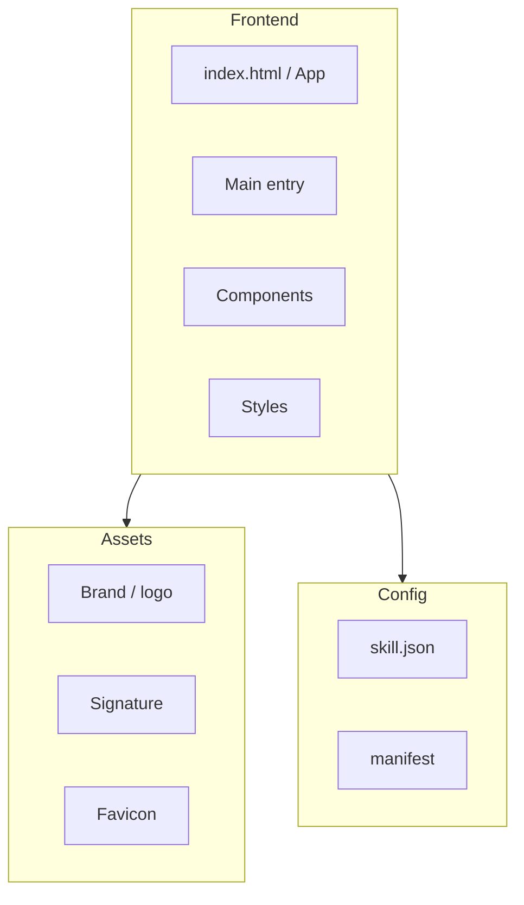
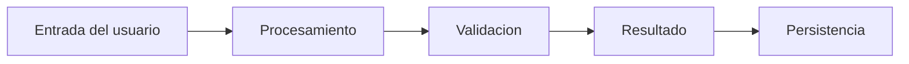

# ARCHITECTURE.md

> Arquitectura del proyecto. Generado automaticamente por `g360 docs --level architecture`.

## Arquitectura General

## Flujo de Datos

## Componentes

| Componente | Responsabilidad |
|---|---|
| Entry point | Punto de inicio de la aplicacion |
| Core | Logica de negocio y configuracion |
| UI | Presentacion e interaccion con el usuario |
| Assets | Recursos estaticos (imagenes, iconos, marca) |
| Config | Archivos de configuracion (skill.json, manifest) |

---

*Generado por `g360 docs --level architecture`*