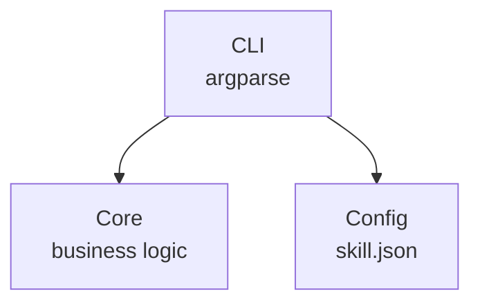

# Mi Proyecto G360 CLI

<picture>
  <source media="(prefers-color-scheme: dark)" srcset="g360/brand/g360/logotypes/logo-g360-light.svg">
  
</picture>

> Aplicacion CLI G360 con Python y argparse

## Quick Start

```bash
uv sync
uv run python src/main.py --help
```

## Estructura del Proyecto



## Identidad de Marca

| Elemento | Valor |
|---|---|
| Marca | G360 |
| Color primario | `#00d084` |
| Signature mode | `powered` |
| Signature text | "powered by G360" |

## Footer

```
G360 by ccusi
```

---

**Marca**: G360 · **Isotipo**: 3 puntos + chevron `>`
**Signature**: powered by G360 · **Powered by**: [g360-signature](https://github.com/carloscus/g360-signature)