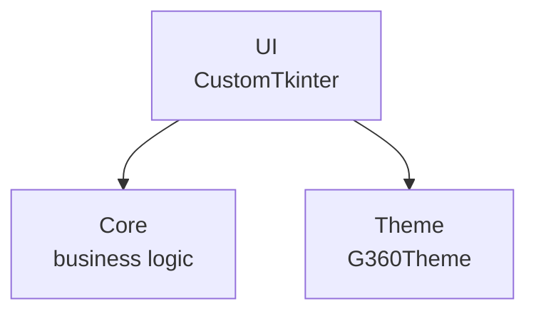

# Mi Proyecto G360 CustomTkinter

<picture>
  <source media="(prefers-color-scheme: dark)" srcset="g360/brand/g360/logotypes/logo-g360-light.svg">
  
</picture>

> Aplicacion de escritorio G360 con CustomTkinter (tema oscuro)

## Quick Start

```bash
uv sync
uv run python src/main.py
```

## Estructura del Proyecto



## Theme y Colores

| Token | Color | Uso |
|---|---|---|
| `bg` | `#0b1220` | Fondo principal |
| `surface` | `#1a2332` | Cards, contenedores |
| `accent` | `#00d084` | Verde G360 primary |
| `text` | `#f0f4f8` | Texto principal |

## Identidad de Marca

| Elemento | Valor |
|---|---|
| Marca | G360 |
| Color primario | `#00d084` |
| Signature mode | `powered` |
| Signature text | "powered by G360" |

## Footer

```python
# Logo embebido como base64 (sin archivos externos)
from core.g360_theme import G360Theme
theme = G360Theme()
logo = theme.logo_base64()
```

---

**Marca**: G360 · **Isotipo**: 3 puntos + chevron `>`
**Signature**: powered by G360 · **Powered by**: [g360-signature](https://github.com/carloscus/g360-signature)