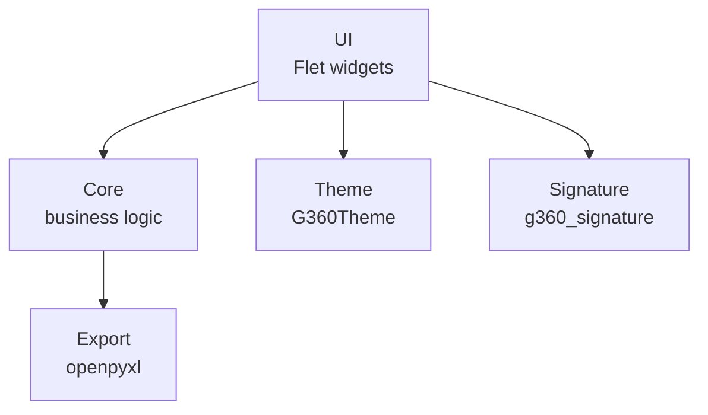

# Mi Proyecto G360 Flet

<picture>
  <source media="(prefers-color-scheme: dark)" srcset="g360/brand/g360/logotypes/logo-g360-light.svg">
  
</picture>

> Aplicacion de escritorio G360 con Flet (ERP)

## Quick Start

```bash
uv sync
uv run python src/main.py
```

## Estructura del Proyecto



## Theme y Colores

| Token | Color | Uso |
|---|---|---|
| `bg` | `#0b1220` | Fondo principal |
| `surface` | `#1a2332` | Cards, contenedores |
| `accent` | `#00d084` | Verde G360 primary |
| `text` | `#f0f4f8` | Texto principal |
| `muted` | `#94a3b8` | Texto secundario |

## Lineamientos de Arquitectura

1. **src/core/**: Solo logica de negocio, sin importar flet
2. **src/ui/**: Importa flet y core. Solo presentacion
3. **src/export/**: Importa openpyxl y core. Solo reportes
4. **Colores**: Siempre via G360Theme. Nunca hardcodear

## Identidad de Marca

| Elemento | Valor |
|---|---|
| Marca | G360 |
| Color primario | `#00d084` |
| Signature mode | `own` |
| Signature text | "G360 Desktop" |

## Footer

```python
from core.components.g360_signature import g360_footer
page.add(g360_footer())
```

---

**Marca**: G360 · **Isotipo**: 3 puntos + chevron `>`
**Signature**: G360 Desktop · **Powered by**: [g360-signature](https://github.com/carloscus/g360-signature)